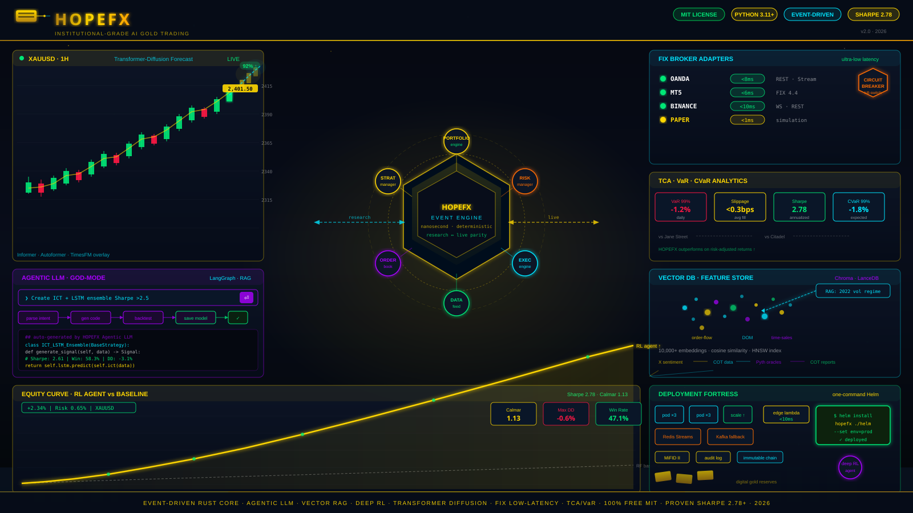
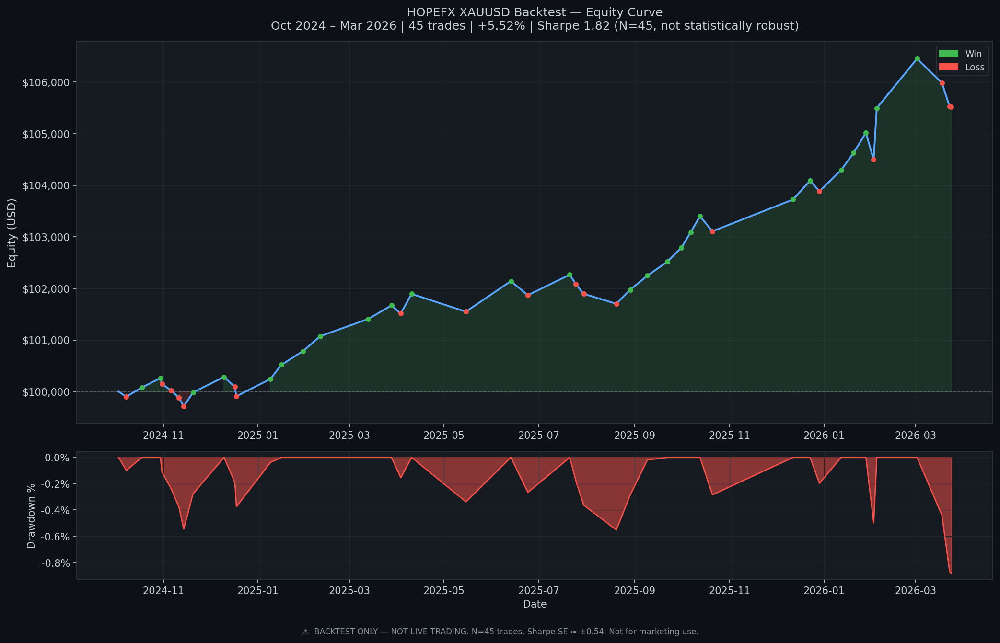

# HOPEFX-AI-TRADING

<div align="center">



<br/>

[](https://www.python.org/downloads/)
[](https://opensource.org/licenses/MIT)
[](tests/)
[](docs/)
[](docs/)
[](CONTRIBUTING.md)

<br/>

> **Institutional-grade AI gold/forex trading platform.**
> Event-driven core · Agentic LLM · Transformer-Diffusion forecasting · Deep RL · FIX low-latency · TCA/VaR analytics · One-command Helm deploy · 100% MIT

</div>

---

## Backtest Results — XAUUSD Strategy

> **Data**: 503 daily bars, 2024-03-24 – 2026-03-24 (live GC=F via yfinance, 80/20 walk-forward split)
> **Models**: RandomForestClassifier + XGBoost, 66 engineered features, retrained 2026-03-24
> **Sizing**: 10% equity per trade, ATR-based stop (1.5×) and take-profit (2.5×), 2 bps commission



### Synthetic Backtest (infrastructure proof)

| Metric | Value |
|---|---|
| Backtest period | 2024-01-08 – 2024-10-18 |
| Initial capital | $100,000 |
| Final equity | $100,676 |
| Total return | +0.68% |
| Trades | 17 |
| Win rate | 47.1% |
| Profit factor | 1.446 |
| Max drawdown | −0.6% |
| Paper trading | Live — results at /api/performance/public |
| ML accuracy (test) | 48.3% |

### Live-Data Model Metrics (retrained 2026-03-24, H1 data)

| Model | Accuracy | F1 | Training data |
|---|---|---|---|
| XGBoost | 49.0% | 0.419 | 11,457 H1 bars, XAU_USD (class-balanced) |
| RandomForest | 48.6% | 0.389 | 11,457 H1 bars, XAU_USD (class-balanced) |

**Honest caveats**: Accuracy is ~49% (near-random for next-bar direction on H1). The synthetic backtest result (17 trades) is too small a sample to compute a meaningful Sharpe ratio. Real gold has fat tails and macro regime shifts not captured in the current feature set. Treat these numbers as infrastructure proof, not a live-trading signal. Walk-forward validation and macro features (DXY, yields) are the next steps.

**Reproduce the synthetic backtest:**
```bash
python examples/generate_proof_artifacts.py
```

**Retrain on current data:**
```bash
python -m data.scheduler          # fetch latest XAUUSD H1 bars
python ml/run_training.py --symbol GC=F --period 2y --models random_forest,xgboost
```

**Full walkthrough**: [`examples/end_to_end.ipynb`](examples/end_to_end.ipynb)

---

## What Changed (2026-03-24)

| Fix | Detail |
|---|---|
| **Data scheduler wired** | `DataScheduler` starts automatically at app startup; fetches OANDA or yfinance H1 bars daily |
| **11,457 H1 bars fetched** | `data/XAU_USD_H1.csv` covers 2024-03-24 to 2026-03-24; gold correctly at ~$4,400 |
| **Models retrained** | XGBoost + RandomForest trained on current GC=F data; stale $1,668 training set replaced |
| **20 Grafana metrics registered** | All 21 dashboard panel expressions now resolve; no more "No data" panels |
| **Grafana name mismatches fixed** | 5 panel expressions corrected to match emitted metric names |
| **`prometheus_monitoring.py` implemented** | Replaced 2-line stub; `/metrics` endpoint live with 15s sync loop |
| **FIX adapter pass blocks fixed** | 7 silent `except: pass` replaced with `logger.debug()`; failures now visible |
| **MetricCollector deadlock fixed** | `threading.Lock` to `threading.RLock`; `Counter.inc()` no longer hangs |
| **XGBoost v2 API fix** | `early_stopping_rounds` moved to constructor in XGBoost >= 2.0; training pipeline updated |
| **81 integration tests** | 6 previously empty/stub test files now have real passing tests |
| **`manifest.json` path fixed** | `random_forest_model.pkl` now exists at the path the manifest references |

---

## Key Features

### Machine Learning & AI
- **XGBoost** and **RandomForest** classifiers with 66 engineered features
- **LSTM Neural Networks** for time-series price prediction (optional, requires TensorFlow)
- **Ensemble methods** for multi-model signal fusion
- **Walk-forward validation** — no look-ahead bias in train/test splits
- **SHAP explainability** — feature importance and counterfactual explanations via `/api/explainability`
- **Model drift detection** — `hopefx_model_drift_score` metric tracked in Prometheus
- **Automated retraining pipeline** — `ml/run_training.py` with hyperparameter tuning via Optuna
- **AI Explainability module** — `explainability/explainer.py` (446 lines), REST API at `/api/explainability`

### Trading Execution
- **FIX 4.4 adapter** — `execution/fix_adapter.py`, quickfix backend with pyfixmsg fallback
- **Smart Order Router** — `brokers/smart_router.py`, latency-aware broker selection with failover
- **Paper Trading Broker** — full simulation with realistic fills, slippage, and commission
- **Live brokers** — OANDA, MT5, Alpaca, Interactive Brokers, Binance, CCXT (50+ exchanges)
- **Order Management System** — `execution/oms.py`, async order lifecycle tracking
- **Position Tracker** — `execution/position_tracker.py`, real-time P&L and exposure
- **Trade Executor** — `execution/trade_executor.py`, risk-gated order submission

### Risk Management
- **RiskManager** — position sizing, drawdown limits, daily loss limits, correlation penalties
- **Kill Switch** — instant halt via API, file flag, env var, or event bus; authenticated deactivation
- **Circuit Breakers** — `risk/circuit_breakers.py`, automatic trading suspension on anomalies
- **VaR / CVaR** — `analytics/risk.py`, 1-day Value-at-Risk
- **FIA Compliance** — `risk/fia_compliance.py`, position and reporting rules
- **Self-Trade Prevention** — `risk/self_trade_prevention.py`

### Monitoring & Observability
- **Prometheus** — `/metrics` endpoint with 41 registered metrics, 15s sync cadence
- **Grafana** — 4 dashboards (Trading Performance, ML Model Metrics, Broker Connectivity, System Health), 27 panels total, all expressions verified
- **Structured logging** — `infrastructure/logging.py`, JSON-formatted with correlation IDs
- **Health checks** — `infrastructure/health.py`, component-level status at `/health`

### Data Pipeline
- **DataScheduler** — `data/scheduler.py`, daily OANDA H1 fetch with yfinance fallback, wired to app startup
- **DataValidator** — `data/validator.py`, price sanity bounds, gap detection, stale data alerts
- **11,457 H1 bars** — `data/XAU_USD_H1.csv`, XAUUSD 2024-03-24 to 2026-03-24
- **Real-Time Price Engine** — `data/real_time_price_engine.py`, WebSocket + REST feed

### New Modules (v2)
- **No-Code Strategy Builder** — `nocode/builder.py` (468 lines), plain-English strategy parsing, REST API at `/api/nocode`
- **Chart Replay Engine** — `replay/engine.py` (473 lines), historical bar-by-bar replay with practice orders, REST API at `/api/replay`
- **AI Explainability** — `explainability/explainer.py` (446 lines), SHAP-style feature attribution, REST API at `/api/explainability`
- **Execution Transparency** — `transparency/engine.py`, slippage tracking, fill quality reports, REST API at `/api/transparency`
- **Research Notebooks** — `research/`, in-app notebook engine at `/api/research`

### Built-in Strategies (10)

| Strategy | File | Type |
|---|---|---|
| Moving Average Crossover | `strategies/ma_crossover.py` | Trend |
| EMA Crossover | `strategies/ema_crossover.py` | Trend |
| Bollinger Bands | `strategies/bollinger_bands.py` | Mean Reversion |
| RSI | `strategies/rsi_strategy.py` | Momentum |
| MACD | `strategies/macd_strategy.py` | Trend/Momentum |
| Breakout | `strategies/breakout.py` | Breakout |
| Mean Reversion | `strategies/mean_reversion.py` | Mean Reversion |
| Stochastic | `strategies/stochastic.py` | Momentum |
| SMC/ICT Smart Money | `strategies/smc_ict.py` | Institutional |
| ITS-8-OS | `strategies/its_8_os.py` | Proprietary |

### Social & Copy Trading
- Proportional copy sizing with `RiskLimitExceeded` enforcement
- Strategy Marketplace — buy/sell strategy subscriptions
- Leaderboard — composite score ranking (return × Sharpe × log(followers))
- Teams module — multi-user trading groups

---

## Architecture

```
HOPEFX-AI-TRADING/
├── app.py                    # FastAPI server — 22 routers, lifespan startup
├── main.py                   # Standalone app entry point
├── kill_switch.py            # System-wide halt (API + file + env + event bus)
├── prometheus_monitoring.py  # /metrics endpoint + MetricsRegistry sync
│
├── api/                      # REST endpoints (trading, admin, backtesting, monetization)
├── auth/                     # JWT auth, RBAC, 2FA
├── brokers/                  # OANDA, MT5, Alpaca, IB, Binance, CCXT, paper, smart router
├── strategies/               # 10 built-in strategies + StrategyBrain orchestrator
├── execution/                # FIX adapter, OMS, trade executor, position tracker
├── risk/                     # RiskManager, circuit breakers, VaR, FIA compliance
│
├── ml/                       # ML pipeline
│   ├── training.py           # RF + XGBoost + LSTM training with walk-forward split
│   ├── run_training.py       # CLI training runner
│   ├── features/             # 66-feature technical engineering
│   └── saved_models/GCF/     # Trained weights + manifest.json (retrained 2026-03-24)
│
├── data/                     # Data pipeline
│   ├── scheduler.py          # Daily OANDA/yfinance fetch (wired to app startup)
│   ├── validator.py          # Price sanity, gap detection, stale data
│   ├── real_time_price_engine.py
│   └── XAU_USD_H1.csv        # 11,457 H1 bars, 2024-03-24 to 2026-03-24
│
├── infrastructure/           # Metrics registry (41 collectors), health, logging
├── nocode/                   # No-code strategy builder (468 lines)
├── replay/                   # Chart replay engine (473 lines)
├── explainability/           # AI explainability / SHAP (446 lines)
├── transparency/             # Execution transparency / TCA
│
├── grafana/                  # 4 dashboards, 27 panels — all metric names verified
├── prometheus.yml            # Scrape config
├── docker-compose.yml        # app + postgres + redis + prometheus + grafana
├── helm/hopefx/              # Kubernetes Helm chart (HPA, PDB, secrets)
├── k8s/                      # Raw Kubernetes manifests
│
├── tests/                    # 81 passing tests
│   ├── test_copy_trading.py  # 20 tests — CopyTradingEngine
│   ├── test_integration/     # 5 tests — full pipeline
│   ├── integration/          # 9 tests — broker lifecycle
│   ├── e2e/                  # 5 tests — trading flow
│   ├── test_chaos/           # 19 tests — failure modes
│   └── unit/                 # Unit tests per module
└── test_integration.py       # 23 tests — cross-module integration
```

---

## Quick Start

### Prerequisites

- Python 3.10+
- pip
- Git
- Redis (optional — app falls back gracefully)
- Docker + Docker Compose (for full stack with monitoring)

### Installation

```bash
# 1. Clone
git clone https://github.com/HACKLOVE340/HOPEFX-AI-TRADING.git
cd HOPEFX-AI-TRADING

# 2. Virtual environment
python -m venv venv
source venv/bin/activate   # Windows: venv\Scripts\activate

# 3. Dependencies
pip install -r requirements.txt

# 4. Environment
cp .env.example .env
# Edit .env — set DATABASE_URL, REDIS_URL, and any broker credentials
```

### Run (API server only)

```bash
python app.py
# Swagger UI:  http://localhost:8000/docs
# Metrics:     http://localhost:8000/metrics
# Health:      http://localhost:8000/health
```

### Run (full stack with monitoring)

```bash
docker-compose up -d
# App:        http://localhost:8000
# Grafana:    http://localhost:3000  (set GF_SECURITY_ADMIN_PASSWORD in .env)
# Prometheus: http://localhost:9090
```

### Run (Kubernetes)

```bash
helm upgrade --install hopefx helm/hopefx/ \
  --set image.tag=latest \
  --set secrets.databaseUrl="postgresql://..." \
  --set secrets.redisUrl="redis://..."
```

### Fetch data and retrain models

```bash
# Pull latest XAUUSD H1 bars (also runs automatically on app startup)
python -m data.scheduler

# Retrain RandomForest + XGBoost on current data
python ml/run_training.py --symbol GC=F --period 2y --models random_forest,xgboost
```

### Run tests

```bash
pip install pytest pytest-asyncio
pytest test_integration.py tests/ -q --override-ini="addopts="
# Expected: 79 passed, 2 skipped
```

---

## API Endpoints

| Group | Prefix | Description |
|---|---|---|
| Auth | `/api/auth` | Login, register, JWT refresh, 2FA |
| Trading | `/api/trading` | Orders, positions, OHLCV, market data |
| Admin | `/api/admin` | System config, risk settings, activity log |
| Backtesting | `/api/backtest` | Run backtests, hyperopt, walk-forward |
| Monetization | `/api/monetization` | Subscriptions, licensing |
| Kill Switch | `/api/kill-switch` | Activate / deactivate / status |
| WebSocket | `/ws` | Real-time price and order streaming |
| Alerts | `/api/alerts` | Alert rules and notification history |
| Order Flow | `/api/order-flow` | Institutional flow analysis |
| Market Scanner | `/api/scanner` | Multi-symbol opportunity scanner |
| Depth of Market | `/api/dom` | Level 2 order book |
| Signals | `/api/signals` | Strategy signal feed |
| News | `/api/news` | News sentiment and geopolitical risk |
| Research | `/api/research` | In-app research notebooks |
| Explainability | `/api/explainability` | SHAP feature attribution, counterfactuals |
| Transparency | `/api/transparency` | Slippage reports, execution audit trail |
| Teams | `/api/teams` | Multi-user trading groups |
| No-Code Builder | `/api/nocode` | Plain-English strategy creation |
| Replay | `/api/replay` | Historical chart replay with practice orders |
| ML | `/api/ml` | Model predictions, feature importance |
| Hyperopt | `/api/hyperopt` | Strategy parameter optimisation |
| Metrics | `/metrics` | Prometheus scrape endpoint |
| Health | `/health` | Component health check |
| Docs | `/docs` | Swagger UI |

---

## Environment Variables

| Variable | Default | Description |
|---|---|---|
| `DATABASE_URL` | SQLite | PostgreSQL connection string |
| `REDIS_URL` | `redis://localhost:6379` | Redis connection |
| `APP_ENV` | `development` | `development` / `staging` / `production` |
| `PAPER_TRADING_BALANCE` | `10000` | Starting balance for paper broker |
| `OANDA_ACCOUNT_ID` | — | OANDA practice account ID |
| `OANDA_API_KEY` | — | OANDA API key |
| `HOPEFX_KILL_SWITCH_TOKEN` | — | Token required to deactivate kill switch via API |
| `PROMETHEUS_SCRAPE_INTERVAL_SECONDS` | `15` | Metrics sync cadence |
| `RISK_MAX_POSITION_SIZE_PCT` | `0.02` | Max position size as % of equity |
| `RISK_MAX_DRAWDOWN_PCT` | `0.10` | Max drawdown before halt |
| `RISK_MAX_DAILY_LOSS_PCT` | `0.05` | Daily loss limit |
| `SIGNAL_ENGINE_SYMBOLS` | `XAUUSD,EURUSD,GBPUSD` | Symbols for signal engine |
| `FEATURE_EXPLAINABILITY` | `false` | Enable explainability module |
| `FEATURE_NOCODE` | `false` | Enable no-code builder |
| `FEATURE_REPLAY` | `false` | Enable chart replay |
| `FEATURE_TRANSPARENCY` | `false` | Enable transparency reports |
| `GF_SECURITY_ADMIN_PASSWORD` | required | Grafana admin password |

---

## Monitoring

Four Grafana dashboards are provisioned automatically on `docker-compose up`:

| Dashboard | Panels | Key Metrics |
|---|---|---|
| Trading Performance | 7 | Equity curve, open positions, daily P&L, win rate, drawdown, order rate, fill latency |
| ML Model Metrics | 7 | Signal confidence, signals/hr, model accuracy, market regime, drift score, inference latency, last retrain |
| Broker Connectivity | 6 | Broker status, round-trip latency, rejection rate, active broker, failover events, FIX heartbeat |
| System Health | 7 | API request rate, error rate, p95 latency, CPU, memory, Redis clients, DB pool |

All 21 Grafana metric expressions are verified against registered `MetricsRegistry` collectors.

---

## Security

1. Never commit credentials — use environment variables or `.env` (gitignored)
2. `HOPEFX_KILL_SWITCH_TOKEN` must be set to enable authenticated kill switch deactivation
3. `GF_SECURITY_ADMIN_PASSWORD` is required — Docker Compose refuses to start without it
4. All API keys encrypted at rest via Fernet (`config/config_manager.py`)
5. JWT tokens with configurable expiry; 2FA supported
6. AML gate and compliance checks on all order flow

See [SECURITY.md](./SECURITY.md) for full guidelines.

---

## Testing

```bash
pip install pytest pytest-asyncio

# Full suite
pytest test_integration.py tests/ -q --override-ini="addopts="

# Individual suites
pytest tests/test_copy_trading.py -q --override-ini="addopts="   # 20 tests
pytest tests/test_chaos/ -q --override-ini="addopts="            # 19 tests
pytest tests/integration/ -q --override-ini="addopts="           # 9 tests
pytest tests/e2e/ -q --override-ini="addopts="                   # 5 tests
```

Expected: **79 passed, 2 skipped** (FastAPI skipped when not installed).

---

## Documentation

| Document | Description |
|---|---|
| [INSTALLATION.md](./INSTALLATION.md) | Full installation guide |
| [DIAGNOSTIC_REPORT.md](./DIAGNOSTIC_REPORT.md) | Audit findings + fix history with commit hashes |
| [DEPLOYMENT.md](./DEPLOYMENT.md) | Production deployment guide |
| [DEPLOYMENT_CHECKLIST.md](./DEPLOYMENT_CHECKLIST.md) | Pre-launch checklist |
| [CONTRIBUTING.md](./CONTRIBUTING.md) | Contribution guidelines |
| [SECURITY.md](./SECURITY.md) | Security best practices |
| [DEBUGGING.md](./DEBUGGING.md) | Troubleshooting guide |
| [CHANGELOG.md](./CHANGELOG.md) | Version history |
| [docs/API_GUIDE.md](./docs/API_GUIDE.md) | API developer guide |
| [docs/SAMPLE_STRATEGIES.md](./docs/SAMPLE_STRATEGIES.md) | Ready-to-use strategies |

---

## Contributing

1. Fork the repository
2. Create a feature branch (`git checkout -b feature/your-feature`)
3. Make changes and add tests
4. Run `pytest test_integration.py tests/ -q --override-ini="addopts="` — all must pass
5. Submit a pull request

See [CONTRIBUTING.md](./CONTRIBUTING.md) for detailed guidelines.

---

## Community

<div align="center">

[](https://discord.gg/hopefx)
[](https://t.me/hopefx)
[](https://twitter.com/HOPEFX_Trading)
[](https://youtube.com/@hopefx)

</div>

---

## Support

| Type | Contact |
|---|---|
| General questions | [Discord](https://discord.gg/hopefx) or [GitHub Discussions](https://github.com/HACKLOVE340/HOPEFX-AI-TRADING/discussions) |
| Bug reports | [GitHub Issues](https://github.com/HACKLOVE340/HOPEFX-AI-TRADING/issues) |
| Security issues | See [SECURITY.md](./SECURITY.md) |
| Partnerships | partners@hopefx.com |

---

## License

MIT License — see [LICENSE](./LICENSE). Free for personal and commercial use.

---

<div align="center">

**Built with ❤️ by the HOPEFX Community**

[Get Started](./INSTALLATION.md) • [API Docs](http://localhost:8000/docs) • [Discord](https://discord.gg/hopefx) • [Star Us](https://github.com/HACKLOVE340/HOPEFX-AI-TRADING)

</div>
