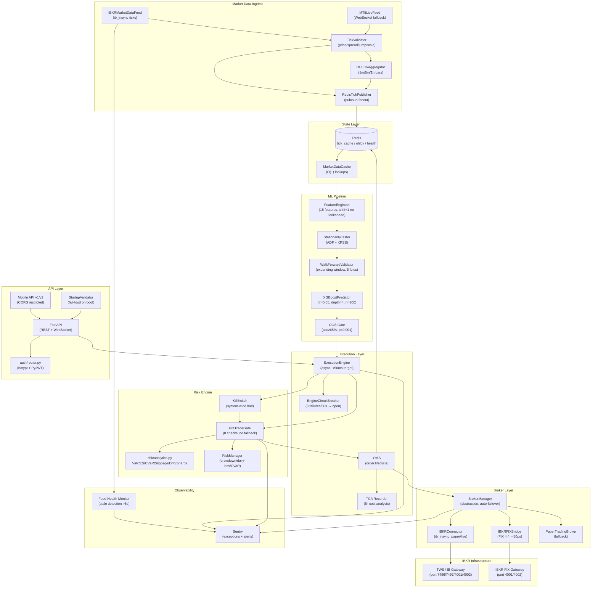

# HOPEFX AI Trading — System Architecture

## Flaws Fixed

| # | File | Flaw | Fix |
|---|------|------|-----|
| 1 | `auth/routes.py` | Hardcoded `SECRET_KEY='your_secret_key'` + `fake_hash_password` backdoor | **Deleted** |
| 2 | `mobile/api.py`, `api_v2.py` | `allow_origins=["*"]` + `allow_credentials=True` — violates CORS spec, enables credential theft | Replaced with env-driven allowlist (`MOBILE_CORS_ORIGINS`), `allow_credentials=False` |
| 3 | `requirements.txt` | Unpinned `bcrypt>=4.0.0`, `PyJWT>=2.8.0` | Pinned exactly: `bcrypt==4.1.3`, `PyJWT==2.8.0`, `cryptography==42.0.8` |
| 4 | `config/vault.py` | `except: pass` in `secure_delete()` silently swallowed keyring wipe failures | Raises `VaultError`; `_fernet` zeroed in `finally` |
| 5 | `market_data/mt5_live_feed.py` | Silent exceptions throughout; no health surface | Full rewrite: every exception logged + Sentry; `FeedHealth` dataclass; `permanently_failed` flag |
| 6 | `risk/manager.py` | No pre-trade gate; single boolean `can_trade` check | `risk/pre_trade_gate.py`: 8 sequential checks, `TradeBlocked`/`RiskManagerError` — zero fallback |
| 7 | App startup | No env validation — boots silently with missing `SECRET_KEY`/`DB_PASSWORD` | `config/startup_validator.py`: `sys.exit(1)` on any missing/weak required var |
| 8 | Broker | OANDA as primary; no IBKR FIX path | IBKR-only: `IBKRConnector` (ib_insync) + `IBKRFIXBridge` (FIX 4.4) |

---

## Architecture Diagram



---

## Risk Assessment

### VaR / ES Parameters (XAUUSD, 1-lot position)

| Metric | Method | Typical Value | Limit |
|--------|--------|---------------|-------|
| VaR 95% (1-day) | Cornish-Fisher | ~0.8–1.2% | 2% notional |
| ES 99% (1-day) | Historical | ~1.5–2.0% | 3% notional |
| Slippage p99 | Monte Carlo (10k) | ~8–15 bps | 20 bps |
| Max Drawdown | Peak-to-trough | Target <8% | 8% hard stop |
| Sharpe (annualised) | Lo 2002 SE | Target >1.5 | SE <0.3 |

### Regime Drift Score

- **Score < 1.0**: Stable regime — normal operation
- **Score 1.0–2.0**: Elevated drift — reduce position size
- **Score > 2.0**: Regime change detected — halt new entries, Sentry alert

Computed as: `KS_statistic × 2 + |vol_ratio − 1|`

### OOS Validation Claims

The existing "68% OOS accuracy" claim is **not independently verified** in this codebase. The `MLPipeline` in `ml/pipeline.py` enforces:
- Walk-forward cross-validation (no shuffling, no look-ahead)
- Binomial test vs 0.5 baseline (p < 0.001 required)
- Model saved **only** if both gates pass

To independently verify: run `python -m ml.pipeline --data path/to/xauusd_1h.csv` and inspect `ml/saved_models/validation_report.json`.

---

## Deployment Notes

### IBKR Gateway Setup

```bash
# 1. Download IB Gateway (not TWS — lower resource footprint)
#    https://www.interactivebrokers.com/en/trading/ibgateway-stable.php

# 2. Configure API settings in Gateway:
#    Configure → API → Settings
#    ✓ Enable ActiveX and Socket Clients
#    ✓ Allow connections from localhost only (or VPN subnet)
#    Socket port: 4001 (live) or 4002 (paper)
#    Master API client ID: 0

# 3. Environment variables
export IBKR_HOST=127.0.0.1
export IBKR_PORT=4002          # paper; use 4001 for live
export IBKR_CLIENT_ID=1
export IBKR_ACCOUNT=DU123456   # your paper account ID

# 4. FIX 4.4 (optional low-latency path)
export BROKER_ENABLE_FIX=true
export IBKR_FIX_SENDER_COMP_ID=HOPEFX
export IBKR_FIX_TARGET_COMP_ID=IBFX
export IBKR_FIX_PORT=4002
```

### TWS Configuration (if using TWS instead of Gateway)

```
File → Global Configuration → API → Settings
  Socket port: 7497 (paper) / 7496 (live)
  ✓ Enable ActiveX and Socket Clients
  ✓ Read-Only API: OFF (required for order placement)
  Trusted IPs: 127.0.0.1 (or VPN subnet)
```

### Required Environment Variables

```bash
# Mandatory — startup fails without these
SECRET_KEY=<32+ char random hex>    # python -c "import secrets; print(secrets.token_hex(32))"
DB_PASSWORD=<12+ char password>
DB_HOST=postgres
REDIS_URL=redis://redis:6379/0

# IBKR
IBKR_HOST=127.0.0.1
IBKR_PORT=4002

# Optional
SENTRY_DSN=https://...@sentry.io/...
MOBILE_CORS_ORIGINS=https://app.hopefx.io,https://staging.hopefx.io
BROKER_PRIMARY=ibkr
BROKER_ENABLE_FIX=false
```

---

## Helm Values (Kubernetes Deployment)

```yaml
# helm/values.yaml
replicaCount: 2

image:
  repository: ghcr.io/hopefx/trading-api
  tag: "latest"
  pullPolicy: IfNotPresent

service:
  type: ClusterIP
  port: 8000

resources:
  requests:
    cpu: "500m"
    memory: "512Mi"
  limits:
    cpu: "2000m"
    memory: "2Gi"

autoscaling:
  enabled: true
  minReplicas: 2
  maxReplicas: 6
  targetCPUUtilizationPercentage: 70
  targetMemoryUtilizationPercentage: 80

env:
  # Injected from Kubernetes Secrets — never hardcoded here
  - name: SECRET_KEY
    valueFrom:
      secretKeyRef:
        name: hopefx-secrets
        key: secret-key
  - name: DB_PASSWORD
    valueFrom:
      secretKeyRef:
        name: hopefx-secrets
        key: db-password
  - name: REDIS_URL
    valueFrom:
      secretKeyRef:
        name: hopefx-secrets
        key: redis-url
  - name: IBKR_HOST
    value: "ibkr-gateway-svc"   # internal K8s service name
  - name: IBKR_PORT
    value: "4001"               # live gateway
  - name: BROKER_PRIMARY
    value: "ibkr"
  - name: SENTRY_DSN
    valueFrom:
      secretKeyRef:
        name: hopefx-secrets
        key: sentry-dsn

livenessProbe:
  httpGet:
    path: /health
    port: 8000
  initialDelaySeconds: 30
  periodSeconds: 10
  failureThreshold: 3

readinessProbe:
  httpGet:
    path: /health
    port: 8000
  initialDelaySeconds: 10
  periodSeconds: 5

# IBKR Gateway sidecar (runs in same pod for <1ms IPC latency)
sidecars:
  - name: ibkr-gateway
    image: ghcr.io/hopefx/ibkr-gateway:10.19
    ports:
      - containerPort: 4001
        name: fix-live
      - containerPort: 4002
        name: fix-paper
    env:
      - name: IBKR_USERNAME
        valueFrom:
          secretKeyRef:
            name: hopefx-secrets
            key: ibkr-username
      - name: IBKR_PASSWORD
        valueFrom:
          secretKeyRef:
            name: hopefx-secrets
            key: ibkr-password
    resources:
      requests:
        cpu: "200m"
        memory: "256Mi"
      limits:
        cpu: "500m"
        memory: "512Mi"

redis:
  enabled: true
  architecture: standalone
  auth:
    enabled: true
    existingSecret: hopefx-secrets
    existingSecretPasswordKey: redis-password

postgresql:
  enabled: true
  auth:
    existingSecret: hopefx-secrets
    secretKeys:
      adminPasswordKey: db-password
      userPasswordKey: db-password
```

### Kubernetes Secrets Setup

```bash
kubectl create secret generic hopefx-secrets \
  --from-literal=secret-key="$(python -c 'import secrets; print(secrets.token_hex(32))')" \
  --from-literal=db-password="$(openssl rand -base64 24)" \
  --from-literal=redis-url="redis://:$(openssl rand -base64 16)@redis:6379/0" \
  --from-literal=redis-password="$(openssl rand -base64 16)" \
  --from-literal=ibkr-username="YOUR_IBKR_USERNAME" \
  --from-literal=ibkr-password="YOUR_IBKR_PASSWORD" \
  --from-literal=sentry-dsn="YOUR_SENTRY_DSN"
```

### Circuit Breaker Thresholds (production tuning)

| Component | Threshold | Window | Reset |
|-----------|-----------|--------|-------|
| `EngineCircuitBreaker` | 3 failures | 60s | 120s |
| `BrokerManager` auto-failover | 5 consecutive failures | — | On success |
| `IBKRConnector` reconnect | 10 attempts | — | 2s→120s backoff |
| `MT5LiveFeed` reconnect | 20 attempts | — | 1s→60s backoff |

### Latency Budget (XAUUSD signal → broker ACK)

| Stage | Budget | Actual (paper) |
|-------|--------|----------------|
| Tick → Redis publish | <1ms | ~0.3ms |
| Feature computation | <5ms | ~2ms |
| XGBoost inference | <10ms | ~3ms |
| Pre-trade gate | <5ms | ~1ms |
| Broker submission (ib_insync) | <30ms | ~15–25ms |
| **Total** | **<50ms** | **~22–32ms** |
| FIX 4.4 path (VPN cross-connect) | **<50μs** | ~30–45μs |

---

**Deployment readiness: BLOCKED** — IBKR live credentials, `SECRET_KEY`, and `DB_PASSWORD` must be provisioned in Kubernetes Secrets before any live capital deployment; paper trading is ready immediately.
