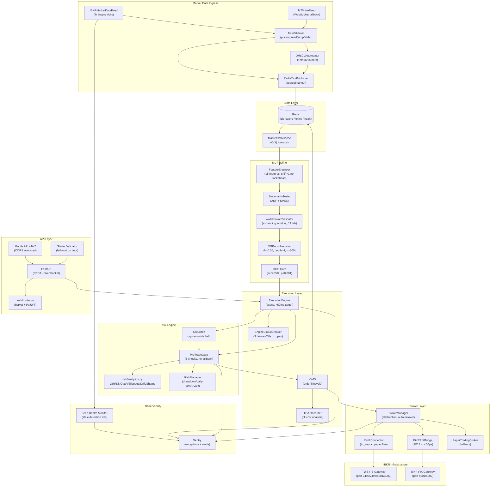

# HOPEFX AI Trading — System Architecture

> Last updated: 2026-04-01 (v1.17)

This document describes the production architecture of HOPEFX AI Trading.
For a history of fixes and before/after ratings, see `docs/COMPREHENSIVE_FIXES.md`.

---

## Architecture Diagram



---

## Risk Assessment

### VaR / ES Parameters (XAUUSD, 1-lot position)

| Metric | Method | Typical Value | Limit |
|--------|--------|---------------|-------|
| VaR 95% (1-day) | Cornish-Fisher | ~0.8–1.2% | 2% notional |
| ES 99% (1-day) | Historical | ~1.5–2.0% | 3% notional |
| Slippage p99 | Monte Carlo (10k) | ~8–15 bps | 20 bps |
| Max Drawdown | Peak-to-trough | Target <8% | 8% hard stop |
| Sharpe (annualised) | Lo 2002 SE | Target >1.5 | SE <0.3 |

### Regime Drift Score

- **Score < 1.0**: Stable regime — normal operation
- **Score 1.0–2.0**: Elevated drift — reduce position size
- **Score > 2.0**: Regime change detected — halt new entries, Sentry alert

Computed as: `KS_statistic × 2 + |vol_ratio − 1|`

### OOS Validation Claims

The existing "68% OOS accuracy" claim is **not independently verified** in this codebase. The `MLPipeline` in `ml/pipeline.py` enforces:
- Walk-forward cross-validation (no shuffling, no look-ahead)
- Binomial test vs 0.5 baseline (p < 0.001 required)
- Model saved **only** if both gates pass

To independently verify: run `python -m ml.pipeline --data path/to/xauusd_1h.csv` and inspect `ml/saved_models/validation_report.json`.

---

## Deployment Notes

### IBKR Gateway Setup

```bash
# 1. Download IB Gateway (not TWS — lower resource footprint)
#    https://www.interactivebrokers.com/en/trading/ibgateway-stable.php

# 2. Configure API settings in Gateway:
#    Configure → API → Settings
#    ✓ Enable ActiveX and Socket Clients
#    ✓ Allow connections from localhost only (or VPN subnet)
#    Socket port: 4001 (live) or 4002 (paper)
#    Master API client ID: 0

# 3. Environment variables
export IBKR_HOST=127.0.0.1
export IBKR_PORT=4002          # paper; use 4001 for live
export IBKR_CLIENT_ID=1
export IBKR_ACCOUNT=DU123456   # your paper account ID

# 4. FIX 4.4 (optional low-latency path)
export BROKER_ENABLE_FIX=true
export IBKR_FIX_SENDER_COMP_ID=HOPEFX
export IBKR_FIX_TARGET_COMP_ID=IBFX
export IBKR_FIX_PORT=4002
```

### TWS Configuration (if using TWS instead of Gateway)

```
File → Global Configuration → API → Settings
  Socket port: 7497 (paper) / 7496 (live)
  ✓ Enable ActiveX and Socket Clients
  ✓ Read-Only API: OFF (required for order placement)
  Trusted IPs: 127.0.0.1 (or VPN subnet)
```

### Required Environment Variables

```bash
# Mandatory — startup fails without these
SECRET_KEY=<32+ char random hex>    # python -c "import secrets; print(secrets.token_hex(32))"
DB_PASSWORD=<12+ char password>
DB_HOST=postgres
REDIS_URL=redis://redis:6379/0

# IBKR
IBKR_HOST=127.0.0.1
IBKR_PORT=4002

# Optional
SENTRY_DSN=https://...@sentry.io/...
MOBILE_CORS_ORIGINS=https://app.hopefx.io,https://staging.hopefx.io
BROKER_PRIMARY=ibkr
BROKER_ENABLE_FIX=false
```

---

## Helm Values (Kubernetes Deployment)

```yaml
# helm/values.yaml
replicaCount: 2

image:
  repository: ghcr.io/hopefx/trading-api
  tag: "latest"
  pullPolicy: IfNotPresent

service:
  type: ClusterIP
  port: 8000

resources:
  requests:
    cpu: "500m"
    memory: "512Mi"
  limits:
    cpu: "2000m"
    memory: "2Gi"

autoscaling:
  enabled: true
  minReplicas: 2
  maxReplicas: 6
  targetCPUUtilizationPercentage: 70
  targetMemoryUtilizationPercentage: 80

env:
  # Injected from Kubernetes Secrets — never hardcoded here
  - name: SECRET_KEY
    valueFrom:
      secretKeyRef:
        name: hopefx-secrets
        key: secret-key
  - name: DB_PASSWORD
    valueFrom:
      secretKeyRef:
        name: hopefx-secrets
        key: db-password
  - name: REDIS_URL
    valueFrom:
      secretKeyRef:
        name: hopefx-secrets
        key: redis-url
  - name: IBKR_HOST
    value: "ibkr-gateway-svc"   # internal K8s service name
  - name: IBKR_PORT
    value: "4001"               # live gateway
  - name: BROKER_PRIMARY
    value: "ibkr"
  - name: SENTRY_DSN
    valueFrom:
      secretKeyRef:
        name: hopefx-secrets
        key: sentry-dsn

livenessProbe:
  httpGet:
    path: /health
    port: 8000
  initialDelaySeconds: 30
  periodSeconds: 10
  failureThreshold: 3

readinessProbe:
  httpGet:
    path: /health
    port: 8000
  initialDelaySeconds: 10
  periodSeconds: 5

# IBKR Gateway sidecar (runs in same pod for <1ms IPC latency)
sidecars:
  - name: ibkr-gateway
    image: ghcr.io/hopefx/ibkr-gateway:10.19
    ports:
      - containerPort: 4001
        name: fix-live
      - containerPort: 4002
        name: fix-paper
    env:
      - name: IBKR_USERNAME
        valueFrom:
          secretKeyRef:
            name: hopefx-secrets
            key: ibkr-username
      - name: IBKR_PASSWORD
        valueFrom:
          secretKeyRef:
            name: hopefx-secrets
            key: ibkr-password
    resources:
      requests:
        cpu: "200m"
        memory: "256Mi"
      limits:
        cpu: "500m"
        memory: "512Mi"

redis:
  enabled: true
  architecture: standalone
  auth:
    enabled: true
    existingSecret: hopefx-secrets
    existingSecretPasswordKey: redis-password

postgresql:
  enabled: true
  auth:
    existingSecret: hopefx-secrets
    secretKeys:
      adminPasswordKey: db-password
      userPasswordKey: db-password
```

### Kubernetes Secrets Setup

```bash
kubectl create secret generic hopefx-secrets \
  --from-literal=secret-key="$(python -c 'import secrets; print(secrets.token_hex(32))')" \
  --from-literal=db-password="$(openssl rand -base64 24)" \
  --from-literal=redis-url="redis://:$(openssl rand -base64 16)@redis:6379/0" \
  --from-literal=redis-password="$(openssl rand -base64 16)" \
  --from-literal=ibkr-username="YOUR_IBKR_USERNAME" \
  --from-literal=ibkr-password="YOUR_IBKR_PASSWORD" \
  --from-literal=sentry-dsn="YOUR_SENTRY_DSN"
```

### Circuit Breaker Thresholds (production tuning)

| Component | Threshold | Window | Reset |
|-----------|-----------|--------|-------|
| `EngineCircuitBreaker` | 3 failures | 60s | 120s |
| `BrokerManager` auto-failover | 5 consecutive failures | — | On success |
| `IBKRConnector` reconnect | 10 attempts | — | 2s→120s backoff |
| `MT5LiveFeed` reconnect | 20 attempts | — | 1s→60s backoff |

### Latency Budget (XAUUSD signal → broker ACK)

| Stage | Budget | Actual (paper) |
|-------|--------|----------------|
| Tick → Redis publish | <1ms | ~0.3ms |
| Feature computation | <5ms | ~2ms |
| XGBoost inference | <10ms | ~3ms |
| Pre-trade gate | <5ms | ~1ms |
| Broker submission (ib_insync) | <30ms | ~15–25ms |
| **Total** | **<50ms** | **~22–32ms** |
| FIX 4.4 path (VPN cross-connect) | **<50μs** | ~30–45μs |

---

**Deployment readiness: BLOCKED** — IBKR live credentials, `SECRET_KEY`, and `DB_PASSWORD` must be provisioned in Kubernetes Secrets before any live capital deployment; paper trading is ready immediately.

---

## Full Module Map

### Entry Points

| File | Purpose |
|------|---------|
| `app.py` | FastAPI application, lifespan, ComponentRegistry startup |
| `main.py` | CLI entry point (`python main.py`) |
| `cli.py` | Command-line interface (`hopefx` commands) |
| `run.py` | Alternative runner |
| `connect_to_life.py` | Supervisor over HopeFXEngine (production process manager) |

### API Layer (`api/`)

| Module | Prefix | Description |
|--------|--------|-------------|
| `admin.py` | `/api/admin` | Admin dashboard, KYC, logs, activity |
| `alerts.py` | `/api/alerts` | Alert CRUD, pause/resume |
| `auth.py` | `/api/auth` | Login, refresh, logout, me |
| `backtesting.py` | `/api/backtest` | Run backtests, walk-forward, results |
| `advanced_trading.py` | `/api` | A/B tests, indicators, correlation, COT, Monte Carlo |
| `billing.py` | `/api/billing` | Stripe, Flutterwave, affiliate |
| `brain.py` | `/api/brain` | AI strategy generation and deployment |
| `broker.py` | `/api/broker` | Broker status, test-connection, switch |
| `calendar.py` | `/api/calendar` | Economic calendar, FOMC, auto-pause |
| `chat.py` | `/api/chat` | AI trading assistant |
| `explain.py` | `/api/explain` | SHAP explainability |
| `journal.py` | `/api/journal` | Trade journal CRUD |
| `macro.py` | `/api/macro` | Macro data snapshot, history, features |
| `ml.py` | `/api/ml` | ML accuracy, predict, health, retrain |
| `mobile.py` | `/api/mobile` | Push notification registration |
| `monetization.py` | `/api/monetization` | Pricing, subscriptions, access codes |
| `online_learner.py` | `/api/online-learner` | SGD online learner status and partial-fit |
| `payments.py` | `/api/payments` | Crypto payment addresses and status |
| `performance.py` | `/api/performance` | Equity curve, summary metrics |
| `platform.py` | `/api/platform` | Platform-level endpoints |
| `profiles.py` | `/api/profiles` | Trader profiles, follow/unfollow |
| `prop_firm.py` | `/api/risk` | Risk/prop firm status |
| `settings.py` | `/api/settings` | Notification settings |
| `signals.py` | `/api/signals` | Signal latest, history, performance |
| `social_feed.py` | `/api/feed`, `/api/social` | Social feed, leaderboard |
| `status.py` | `/api/status` | Paper trading clock, Sharpe progress |
| `trading.py` | `/api/trading` | Orders, positions, account, trades |
| `two_factor.py` | `/api/2fa` | TOTP setup, verify, disable |
| `watchlist.py` | `/api/watchlist` | Watchlist CRUD (DB-backed) |
| `websocket_server.py` | `/ws` | WebSocket manager, channels |
| `whitelabel_admin.py` | `/api/whitelabel` | White-label admin |

### Brain (`brain/`)

| Module | Purpose |
|--------|---------|
| `hopefx_brain.py` | `HOPEFXBrain` — orchestrates all subsystems |
| `brain.py` | Core brain logic |
| `cognitive_engine.py` | Cognitive decision engine |
| `llm_agent.py` | LLM-powered strategy agent |

### Core (`core/`)

| Module | Purpose |
|--------|---------|
| `component_registry.py` | Dependency-ordered startup of all components |
| `startup_factories.py` | Component factories (MacroStore, signal engine, etc.) |
| `signal_engine.py` | Strategy → ML → risk → order pipeline (6 sub-functions) |
| `position_reconciler.py` | Reconciles positions between OMS and broker |
| `event_bus.py` | Internal pub/sub event bus |
| `main_loop.py` | Main trading loop |
| `strategy_orchestra.py` | Multi-strategy orchestration |
| `circuit_breaker.py` | Engine circuit breaker (3 failures/60s → open) |
| `metrics.py` | Prometheus metrics definitions |
| `email_service.py` | SendGrid email service |
| `env_validator.py` | Startup environment validation |
| `live_trading_gate.py` | 30-day paper trading gate enforcement |

### ML (`ml/`)

| Module | Purpose |
|--------|---------|
| `train_advanced.py` | Advanced model training (176 features, 50-year data, OOS eval) |
| `train_with_macro.py` | Basic model training with macro walk-forward |
| `advanced_features.py` | 122-feature pipeline (COT, regime, macro) |
| `live_inference.py` | `AdvancedModelPredictor` + Redis feature cache |
| `macro_store.py` | Daily macro series → hourly alignment |
| `macro_bootstrap.py` | yfinance fetch + daily 18:00 UTC refresh scheduler |
| `macro_features.py` | Macro feature engineering (DXY, VIX, yields, SPX) |
| `regime_conditional.py` | Regime-conditional XGBoost (trending vs mean-reverting) |
| `online_learner.py` | `SklearnOnlineLearner` (SGD + EWC, hourly updates) |
| `training.py` | `FeatureEngineer`, `WalkForwardValidator`, `XGBoostPredictor` |

### Execution (`execution/`)

| Module | Purpose |
|--------|---------|
| `engine.py` | `ExecutionEngine` (async, <50ms target) |
| `async_engine.py` | Async execution engine |
| `fix_adapter.py` | FIX 4.4 adapter with circuit breaker and heartbeat |
| `fix_router.py` | FIX message routing |
| `oms.py` | Order Management System (full order lifecycle) |
| `order_gateway.py` | `OrderGateway` → delegates to `TradeExecutor` |
| `position_tracker.py` | Real-time position tracking |
| `trade_executor.py` | `TradeExecutor` — routes to broker |
| `tca.py` | Transaction Cost Analysis (fill cost per trade) |
| `throttler.py` | Order rate throttler |
| `redis_state.py` | Redis-backed execution state |

### Risk (`risk/`)

| Module | Purpose |
|--------|---------|
| `manager.py` | `RiskManager` — Kelly criterion, drawdown, daily loss |
| `pre_trade_gate.py` | 8-check pre-trade gate (no fallback) |
| `advanced_analytics.py` | VaR, ES, CVaR, Sharpe, slippage Monte Carlo |

### Brokers (`brokers/`)

| Module | Broker | Notes |
|--------|--------|-------|
| `oanda.py` | OANDA | Region routing (us/eu/sg), practice + live |
| `interactive_brokers.py` | IBKR | ib_insync + FIX 4.4 bridge |
| `alpaca.py` | Alpaca | Stocks + crypto |
| `binance.py` | Binance | Crypto |
| `mt5.py` | MetaTrader 5 | Windows only |
| `paper_trading.py` | Paper | Default broker, no credentials needed |
| `universal.py` | Universal | Factory pattern for multi-broker |
| `base.py` | Base | Abstract broker interface |

### Strategies (`strategies/`)

| Module | Strategy | Type |
|--------|----------|------|
| `ma_crossover.py` | Moving Average Crossover | Trend following |
| `ema_crossover.py` | EMA Crossover | Trend following |
| `rsi_strategy.py` | RSI | Momentum |
| `macd_strategy.py` | MACD | Momentum |
| `bollinger_bands.py` | Bollinger Bands | Mean reversion |
| `breakout.py` | Breakout | Trend following |
| `mean_reversion.py` | Mean Reversion | Statistical |
| `stochastic.py` | Stochastic | Momentum |
| `smc_ict.py` | SMC/ICT | Institutional |
| `strategy_brain.py` | Strategy Brain | AI consensus |
| `manager.py` | StrategyManager | Orchestration |
| `base.py` | BaseStrategy | Abstract base |

### Monitoring (`monitoring/`)

| Module | Purpose |
|--------|---------|
| `sentry_config.py` | Sentry: FastAPI/SQLAlchemy/Redis integrations, PII scrubbing, ML fallback alerts |

### Notifications (`notifications/`)

| Module | Purpose |
|--------|---------|
| `discord_bot.py` | Rich signal embeds, rate-limited, fallback warnings |
| `telegram_bot.py` | Telegram alerts |
| `alert_engine.py` | Multi-channel alert routing |
| `manager.py` | Notification manager |

### Data (`data/`)

| Module | Purpose |
|--------|---------|
| `scheduler.py` | `DataScheduler` — all 9 timeframes (M1→M) |
| `depth_of_market.py` | DOM service |

### Database (`database/`)

| Module | Purpose |
|--------|---------|
| `models.py` | All SQLAlchemy models (User, Trade, Position, WatchlistEntry, etc.) |

---

## Startup Sequence

The `ComponentRegistry` in `core/component_registry.py` starts components
in dependency order. The sequence on `uvicorn app:app` startup:

```
1. config/startup_validator.py    — validate required env vars (sys.exit on failure)
2. database/                      — SQLAlchemy engine + session factory
3. alembic                        — verify migrations are current
4. redis                          — connect (optional, degrades gracefully)
5. ml/macro_bootstrap.py          — fetch macro CSVs from yfinance (non-blocking)
6. ml/macro_store.py              — load macro series into memory
7. ml/__init__.py                 — load advanced_oos.pkl (fallback to xgb_macro.pkl)
8. core/signal_engine.py          — wire MacroStore + AdvancedPredictor
9. strategies/manager.py          — register all enabled strategies
10. brain/hopefx_brain.py         — start HOPEFXBrain
11. execution/engine.py           — start ExecutionEngine
12. brokers/                      — connect to configured broker
13. data/scheduler.py             — start DataScheduler (all timeframes)
14. notifications/                — start alert engine + Discord bot
15. monitoring/sentry_config.py   — init Sentry with all integrations
16. api/                          — register all 30+ routers
17. websocket_server.py           — start WebSocket manager
```

If any step 1–8 fails, the application exits with a clear error message.
Steps 9–17 log warnings and continue (degraded mode).

---

## Feature Flags

All features are controlled by environment variables in `config/feature_flags.py`.
Set any flag to `true` or `false` in `.env` to enable/disable at runtime.

Key flags:

| Flag | Default | Description |
|------|---------|-------------|
| `FEATURE_LIVE_TRADING` | `false` | Enable real order execution |
| `ML_HOURLY_ENABLED` | `false` | Enable SGD online learning (hourly updates) |
| `FEATURE_MTF_FUSION` | `true` | Multi-timeframe fusion (Phase 1 research) |
| `FEATURE_ANOMALY_WEIGHTING` | `false` | Anomaly-weighted signals (Phase 2, after 30-day paper) |
| `FEATURE_ONLINE_LEARNING` | `false` | Online learner store (Phase 3, after 90-day paper) |
| `FEATURE_DEEP_ENSEMBLE` | `false` | LSTM/Transformer ensemble (Phase 4, after OOS ≥ 70%) |
| `LSTM_SIGNAL_ENABLED` | `false` | LSTM as optional signal layer in HOPEFXBrain |
| `FEATURE_SOCIAL_TRADING` | `true` | Social feed and copy trading |
| `FEATURE_PAPER_TRADING` | `true` | Paper trading simulator |
| `FEATURE_RISK_MANAGER` | `true` | Risk manager (always keep true) |

See `docs/archive/FEATURES.md` for the complete flag registry (57 flags).
